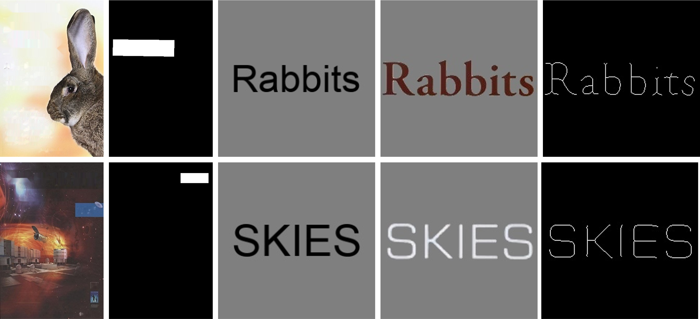

# Font Style that Fits an Image -- Font Generation Based on Image Context

## Introduction
This is the code of paper *Font Style that Fits an Image -- Font Generation Based on Image Context* by pytorch, which proposed method of generating a book title image based on its context within a book cover.

Original paper:[Font Style that Fits an Image -- Font Generation Based on Image Context](https://arxiv.org/abs/2105.08879)

 

## Prepare data
Our dataset consist of 5 type of images.
- `style cover image`
- `style cover mask image`
- `input text image`
- `true title image`
- `true skeleton image`

 

From left to right: style cover image, style cover mask image, input text image, true title image, true skeleton.

You can prepare the dataset here:[TGNet-Datagen](https://github.com/Taylister/TGNet-Datagen)

## Train the model
Firstly clone this repository.
```
$ git clone https://github.com/Taylister/TGNet
```
Once the data is ready, put the images in different directories with the same name.

You can see the path information and training parameters in `cfg.py` if you want.

Then run `python train.py` to start training.

## Predict

To generate the stylezed text, you need `style cover image`, `style cover mask image`, `input text image`.

At first, create the folder structure bellow. 
```
.
├─ [example_data_dir]  (default:dataset)
│　 └─ [torp] (default:test)
│      ├─ [style] (default:cover_inpaint)
│      ├─ [style_mask] (default:cover_mask)
│      └─ [input_text]  (default:input_text)
.
```
And then, store the images in the corresponding folders.

Finnaly, You can predict your own data with
```
$ python3 predict.py
```

Again, you can see the information of folder structure in `cfg.py`.

## Requirements
Now writing

## Reference
- [youdao-ai/SRNet](https://github.com/youdao-ai/SRNet)
- [youdao-ai/SRNet-Datagen](https://github.com/youdao-ai/SRNet-Datagen)
- [Niwhskal/SRNet](https://github.com/Niwhskal/SRNet)
- [Font Style that Fits an Image -- Font Generation Based on Image Context](#)
